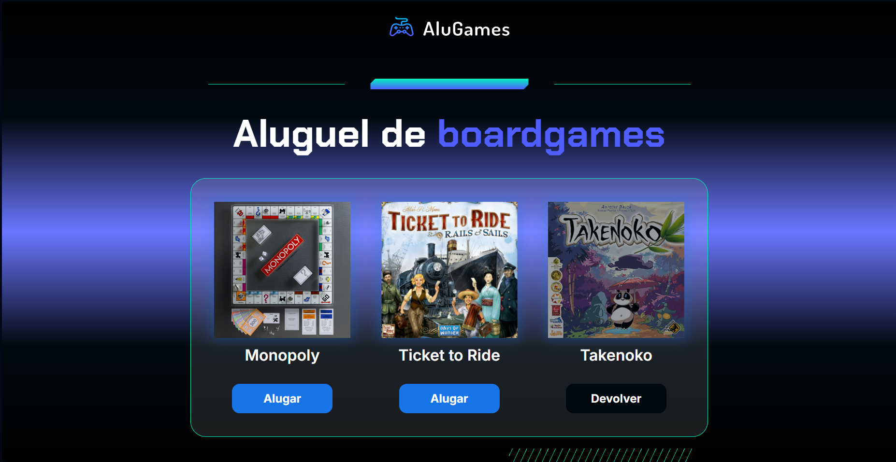

# AluGames 🎲

Bem-vindo ao **AluGames**, um sistema simples e visual para aluguel de *boardgames*, desenvolvido com **HTML**, **CSS** e **JavaScript**!  
Com o AluGames, é possível alternar entre o status dos jogos (alugado ou disponível) com um simples clique.

## 🚀 Funcionalidades

- Visualização de uma lista de jogos disponíveis para aluguel.
- Alteração do status dos jogos entre **Alugar** e **Devolver**.
- Estilização dinâmica para indicar jogos que estão alugados.
- Interação com o usuário por meio de cliques, sem recarregar a página.

## 🛠️ Tecnologias Utilizadas

- **HTML5** para estruturar o site.
- **CSS3** para estilização com responsividade e efeitos visuais.
- **JavaScript (Vanilla)** para manipulação do DOM e lógica de mudança de status.

## 🎮 Como Usar

1. Faça o download ou clone este repositório.
2. Abra o arquivo `index.html` em seu navegador.
3. Clique no botão **Alugar** para marcar um jogo como alugado.
4. Clique no botão **Devolver** para disponibilizar o jogo novamente.

## 📁 Estrutura de Pastas

```
AlugarJogos/
│
├── index.html        # Estrutura da página
├── css/
│   ├── main.css      # Estilização principal
│   └── _reset.css    # Reset de estilos
├── js/
│   └── app.js        # Lógica de aluguel e devolução
└── img/              # Imagens dos jogos e elementos visuais
```

## 🧠 Aprendizado

Este projeto foi criado com foco no aprendizado e prática de:
- Manipulação do **DOM** com JavaScript.
- Uso de **classes CSS dinâmicas** para indicar estados.
- Estruturação semântica com HTML.
- Aplicação de **design responsivo** com CSS moderno.
- Interação com o usuário utilizando **eventos de clique**.

## ✨ Demonstração



## 📢 Contribuições

Contribuições são bem-vindas!  
Sinta-se à vontade para abrir uma issue ou criar um pull request com melhorias ou novas funcionalidades. 🙌

---

Feito com dedicação por [Gustavo Marques](https://github.com/GustavoMarques22) 💙

---
